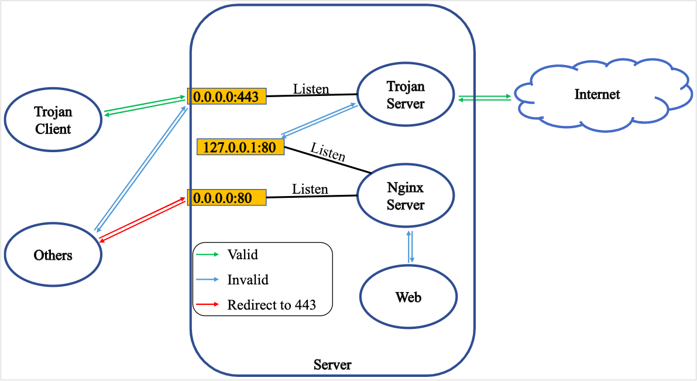

# Trojan



> 準備域名，並且指定好

## 一鍵腳本
> [hijkpw/scripts](https://github.com/hijkpw/scripts)
Centos7
```
bash <(curl -sL https://raw.githubusercontent.com/hijkpw/scripts/master/trojan.sh)
```

```
#检查服务
systemctl status trojan-gfw

#开启服务
systemctl start trojan-gfw

#关闭服务
systemctl stop trojan-gfw

#查看client客户端配置文件
cat /usr/src/trojan/server.json
```

---
## 手動安裝
> 支持 自動更新ca, trojan
## 准备材料
* 申请域名：[https://www.freenom.com](https://www.freenom.com)
* 注册cloudflare：[cloudflare](cloudflare)
> 把 freenode 的DNS 控制权 交给 cloudflare
> 准备材料其实跟 **SS + v2ray-plugin 搭建** 大同小异，可以去参考。

## 伺服器搭建环境
### 创建帐户
* 创建群组certusers
* 创建 trojan,acme 属于 certusers
```
sudo groupadd certusers
sudo useradd -r -M -G certusers trojan
sudo useradd -r -m -G certusers acme
```

### 环境
一键安装所有套件
```
sudo apt update ; sudo apt upgrade -y; sudo apt install -y socat cron curl libcap2-bin xz-utils nginx
```

> 安装环境相关套件
> ```
> sudo apt update
> sudo apt upgrade -y
> 
> 安装跟acme.sh 相关的套件(凭证)
> sudo apt install -y socat cron curl
> 
> 安装跟 trojan 相关的套件
> sudo apt install -y libcap2-bin xz-utils nano
> 
> 安装 nginx 伺服器相关套件
> sudo apt install -y nginx
> ```

启动 **cron** 相关套件
```
sudo systemctl start cron
sudo systemctl enable cron
```

### 凭证
创建凭证文件夹
```
sudo mkdir /usr/local/etc/certfiles
sudo chown -R acme:acme /usr/local/etc/certfiles
```

设定凭证
```
进入 acme 用户
sudo su -l -s /bin/bash acme

下载凭证工具
curl https://get.acme.sh | sh 


退出 acme 用户
exit

再次进入 acme 用户
sudo su -l -s /bin/bash acme
```

设定 cloudfare 的环境变数，用于生成凭证
```
export CF_Email="01360086@me.mcu.edu.tw"
export CF_Key="0ea1eec8fa6cc179e459b7c2dd6b2feb2ba79"
```

申请凭证 **<tdom.ml>**改成自己的域名
```
acme.sh --issue --dns dns_cf -d <tdom.ml>
```

安装凭证 **<tdom.ml>**改成自己的域名
```
acme.sh --install-cert -d <tdom.ml> --key-file /usr/local/etc/certfiles/private.key --fullchain-file /usr/local/etc/certfiles/certificate.crt

```
自动更新证书
```
acme.sh  --upgrade  --auto-upgrade
```

修改权限
```
chown -R acme:certusers /usr/local/etc/certfiles
chmod -R 750 /usr/local/etc/certfiles
exit
```
### 安装 Trojan
```
sudo bash -c "$(curl -fsSL https://raw.githubusercontent.com/trojan-gfw/trojan-quickstart/master/trojan-quickstart.sh)"

sudo chown -R trojan:trojan /usr/local/etc/trojan
sudo cp /usr/local/etc/trojan/config.json /usr/local/etc/trojan/config.json.bak
```
修改配置文件
```
sudo nano /usr/local/etc/trojan/config.json
```
* password 修改成自己的, 多的删掉 注意要删掉逗点
* cert和key分别改为/usr/local/etc/certfiles/certificate.crt和/usr/local/etc/certfiles/private.key

```
{
    "run_type": "server",
    "local_addr": "0.0.0.0",
    "local_port": 443,
    "remote_addr": "127.0.0.1",
    "remote_port": 80,
    "password": [
        "dfdfdfdf"
    ],
    "log_level": 1,
    "ssl": {
        "cert": "/usr/local/etc/certfiles/certificate.crt",
        "key": "/usr/local/etc/certfiles/private.key",
        "key_password": "",
        "cipher": "ECDHE-ECDSA-AES256-GCM-SHA384:ECDHE-RSA-AES256-GCM-SHA384:ECDHE-ECDSA-CHACHA20-POLY1305:ECDHE-RSA-CHACHA20-POLY1305:ECDHE-ECDSA-AES128-GCM-SHA256:ECDHE-RSA-AES128-GCM-SHA256:ECDHE-ECDSA-AES256-SHA384:ECDHE-RSA-AES256-SHA384:ECDHE-ECDSA-AES128-SHA256:ECDHE-RSA-AES128-SHA256",
        "cipher_tls13":"TLS_AES_128_GCM_SHA256:TLS_CHACHA20_POLY1305_SHA256:TLS_AES_256_GCM_SHA384",
        "prefer_server_cipher": true,
        "alpn": [
            "http/1.1"
        ],
        "reuse_session": true,
        "session_ticket": false,
        "session_timeout": 600,
        "plain_http_response": "",
        "curves": "",
        "dhparam": ""
    },
    "tcp": {
        "prefer_ipv4": false,
        "no_delay": true,
        "keep_alive": true,
        "reuse_port": false,
        "fast_open": false,
        "fast_open_qlen": 20
    },
    "mysql": {
        "enabled": false,
        "server_addr": "127.0.0.1",
        "server_port": 3306,
        "database": "trojan",
        "username": "trojan",
        "password": ""
    }
}
```

### 启动Trojan
编辑 Trojan
```
sudo nano /etc/systemd/system/trojan.service
```
> 在 `[server]` 添加`User=trojan`
重新读取
```
sudo systemctl daemon-reload
```
赋予Trojan监听443端口能力
```
sudo setcap CAP_NET_BIND_SERVICE=+eip /usr/local/bin/trojan
```

使用systemd启动Trojan

```
重起 Trojan
sudo systemctl restart trojan 

检查 Trojan
sudo systemctl status trojan
```

### 设定 nginx
关闭nginx预设主机

```
sudo rm /etc/nginx/sites-enabled/default
```

写入新的设定 **<tdom.ml>**改成自己的域名

```
sudo nano /etc/nginx/sites-available/<tdom.ml>
```

修改文件内容

```
server { 
    listen 127.0.0.1:80 default_server; 
    server_name <tdom.ml>; 
    location /{ 
        proxy_pass https://www.ietf.org; 
    } 
} 
server { 
    listen 127.0.0.1:80; 
    server_name <10.10.10.10>; return 301 https://<tdom.ml> $request_uri; } server {     listen 0.0.0.0:80;     listen [::]:80;     server_name _; return 301 https:// $host $request_uri; }
```

* server_name <tdom.ml> ，修改为自己的域名
* `proxy_pass https://www.ietf.org` 修改成不敏感的网站
* `server_name <10.10.10.10>`修改成自己的IP
* https://<tdom.ml>，修改为自己的域名

使能配置文件注意域名<tdom.ml>改为你自己的域名

```
sudo ln -s /etc/nginx/sites-available/<tdom.ml> /etc/nginx/sites-enabled/
```

### 启动Nginx

```
sudo systemctl restart nginx 
sudo systemctl status nginx
```

配置Trojan和Nginx开机自启
```
sudo systemctl enable trojan 
sudo systemctl enable nginx
```

## 参考文献
* [自建梯子教程 --Trojan版本](https://trojan-tutor.github.io/2019/04/10/p41.html)